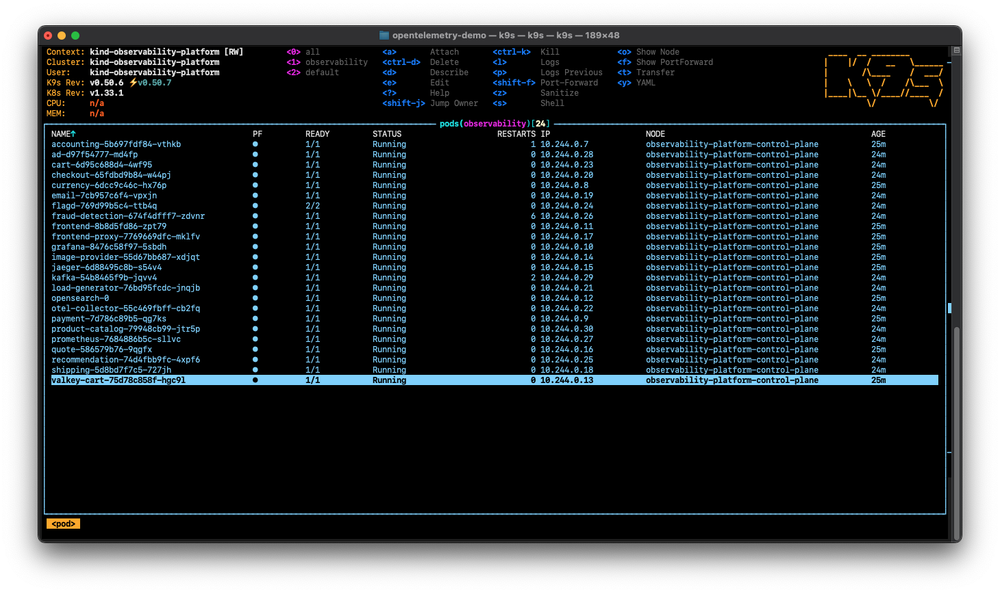

# Local OpenTelemetry Demo Setup with kind & Podman Desktop (macOS)

This setup enables you to run the OpenTelemetry Demo locally using a Kubernetes cluster provisioned with `kind` and containerized using Podman Desktop on macOS. It is tailored for reproducible scientific experiments in observability and cloud-native monitoring.

## 🧰 Requirements

- macOS (tested on macOS Sequoia Version 15.5)
- [Podman Desktop](https://podman.io/)
- [kind](https://kind.sigs.k8s.io/)
- [kubectl](https://kubernetes.io/docs/tasks/tools/)
- [Helm](https://helm.sh/)
- [k9s (optional)](https://k9scli.io/)

## 🚀 Initial Setup and Cluster Provisioning

### 1. Create Podman Machine (VM)
```bash
podman machine init podman-machine-otel-demo --cpus 8 --memory 10248 --disk-size 150
```

### 2. Start Podman Machine
Start Podman VM via the Podman Desktop App or by the following command.

```bash
podman machine start podman-machine-otel-demo
```

### 3. Create Kind Cluster

```bash
kind create cluster --name observability-platform --config ./local-dev/kind-config.yaml
```

### 4. Create Kubernetes namespace
```bash
kubectl create ns observability
```

### 5. Add the OpenTelemetry Helm Chart Repository
```bash
helm repo add open-telemetry https://open-telemetry.github.io/opentelemetry-helm-charts
```

### 6. Update Your Local Helm Repository Cache
```bash
helm repo update
```

### 7. Install the OpenTelemetry Demo Using Helm
> ⚠️ **Important Notice:**  
> Before starting the OpenTelemetry Demo Kubernetes cluster with kind, **please close other applications** such as browsers, IDEs, or heavy background processes.  
> This ensures your system has **enough CPU and memory resources** available to run the cluster smoothly and avoid issues like pod crashes or slow startup.
```bash
helm install observability-platform-demo open-telemetry/opentelemetry-demo --namespace observability
```

### 8. Observe the Cluster Startup with k9s
In a new terminal tab, you can monitor the startup of the Kubernetes cluster using ```k9s```. This helps you verify that all pods are initializing correctly after executing the Helm install in step 7.

```bash
k9s --context kind-observability-platform
```
This will open a terminal-based UI where you can see the pods and their status live. Wait until all pods are in a Running or Completed state before proceeding.



### 9. Port forwarding (each in a separate terminal tab/window)
To access the individual components of the OpenTelemetry Demo via your web browser, forward the following ports. Each command should be run in a separate terminal tab or window:

#### Frontend (Onlineshop)
```bash
kubectl port-forward svc/frontend-proxy 8080:8080 -n observability
```
➜ http://localhost:8080/

#### Prometheus
```bash
kubectl port-forward svc/prometheus 9090:9090 -n observability
```
➜ http://localhost:9090/query

#### Grafana
```bash
kubectl port-forward svc/grafana 3000:80 -n observability
```
➜ http://localhost:3000/

#### Jaeger
```bash
kubectl port-forward svc/jaeger-query 16686:16686 -n observability
```
➜ http://localhost:16686/jaeger/ui/search

#### Locust (Load generator)
➜ http://localhost:8080/loadgen/

## 🛑 Shut Down the Cluster and Demo
To shut down the OpenTelemetry demo and the local Kubernetes cluster cleanly:

### 1. Close all terminal windows with active kubectl port-forward
If you started port-forwardings in separate tabs, simply close those terminal tabs or press ```Ctrl+C``` in each.

To forcefully stop all port-forwardings:
```bash
pkill -f "kubectl port-forward"
```

### 2. Uninstall the OpenTelemetry demo
This removes all deployed demo components but keeps the namespace and cluster:
```bash
helm uninstall observability-platform-demo -n observability
```

### 3. Delete the namespace
Optional: If you want a fully clean state:

```bash
kubectl delete ns observability
```

### 4. Stop the kind cluster (indirectly by stopping Podman)
```bash
podman machine stop podman-machine-otel-demo
```
- This also stops the kind cluster, which is running inside Podman.
- No need to explicitly stop kind — it's tied to Podman's lifecycle.


## ✅ Re-initialize and restart the Cluster
If you want to completely reset the cluster, run:

```bash
kind delete cluster --name observability-platform
```

Then repeat steps 2, 3, 4, and 7 from [Initial Setup and Cluster Provisioning](#1-initial-setup-and-cluster-provisioning).

- Step 2: Start Podman Machine
- Step 3: Create the kind cluster again
- Step 4: Create the observability namespace
- Step 7: Install the OpenTelemetry demo via Helm


## 📄 License
This setup is based on open-source tools and intended for academic and research use. See individual tool licenses for details.

